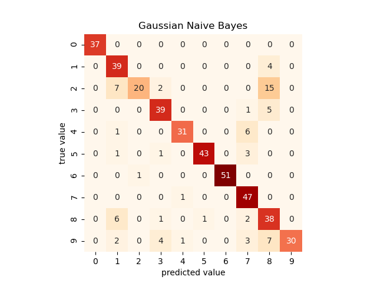

# HW5-digits

Learning goals:

* Practice with scikit-learn API using the digits dataset
* Comparison of various classification methods
* Hyperparameter tuning and model selection

## Instructions

The assignment has 5 questions worth 2 points each.
Submit your solution in this README.md, including any relevant printed output and plots.
Include a series of independent Python modules that can be run
using the Makefile to reproduce the results that you report in this README.md.
The code in your modules should be concise and nicely documented.

For example...

We'll be building on
[05.02 - Introducing Scikit-Learn](https://github.com/jakevdp/PythonDataScienceHandbook/blob/master/notebooks/05.02-Introducing-Scikit-Learn.ipynb) by VanderPlas, which produces train/test accuracy of 0.86/0.83 for Gaussian Naive Bayes
classification of the digits dataset.
You can reproduce those results with
```
make template
```
which prints the train/test accuracy:
```
Train accuracy: 0.86
Test accuracy: 0.83
```
and plots the confusion matrix:



## Question 1

Use the [classification_report](https://scikit-learn.org/stable/modules/generated/sklearn.metrics.classification_report.html) to investigate performance by class. 
In particular, note the variation in the "support" column.
Propose a solution if you think the support may be problematic.
Implement your proposed solution and comment on the results.

## Question 2

Use a decision tree classifier with the same data. 
Investigate model performance using a validation curve. 
Comment briefly on the results (including comparison with results above).

## Question 3

In [5.08 Random Forests](https://github.com/jakevdp/PythonDataScienceHandbook/blob/master/notebooks/05.08-Random-Forests.ipynb), VanderPlas performs digits classification with a random forest. 
He uses `n_estimators=1000`. 
Use a validation curve to investigate the choice of n_estimators.
Comment briefly on the results (including comparison with results above).

## Question 4

Investigate use of 
[AdaBoost](https://scikit-learn.org/stable/modules/generated/sklearn.ensemble.AdaBoostClassifier.html).
Look at the scikit-learn
[adaboost example](https://scikit-learn.org/stable/auto_examples/ensemble/plot_adaboost_hastie_10_2.html) for ideas.
Boosting is discussed in Section 8.2.2 (p345) if ISLR2. 
Comment briefly on results and your choice of hyperparameters (including comparison with results above).

## Question 5

Adapted the use of SVC in cells 18-26 of [Labeled Faces in the Wild demo](https://github.com/jakevdp/PythonDataScienceHandbook/blob/master/notebooks/05.07-Support-Vector-Machines.ipynb) in VanderPlas.
When selecting optimal hyperparameters, make sure that your range encompasses the minimum.
Comment briefly on results and your choice of hyperparameters (including comparison with results above).
